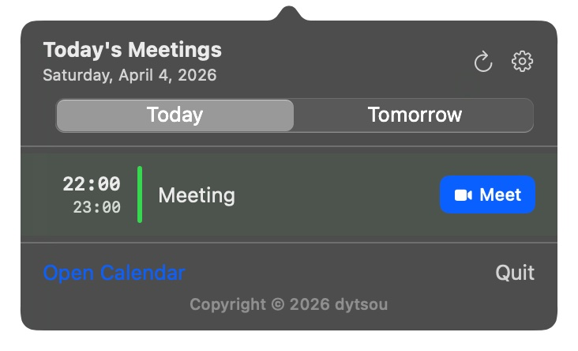

<p align="center">
  
</p>

# NextMeeting


[](https://github.com/dytsou/NextMeeting/actions/workflows/build.yml)
[](https://github.com/dytsou/NextMeeting/releases)
[](LICENSE)

A macOS menu bar app that shows your next meeting at a glance.



## Features

- Displays the next meeting time in the menu bar
- Shows "In Progress" when a meeting is currently active
- Popup list of all remaining meetings today
- Auto-detects video conferencing links (Zoom, Google Meet, Teams, Webex, Whereby)
- One-click join button for detected meeting links; **Settings** sets **App** vs **browser** per provider (Zoom, Google Meet, Teams, Webex, Whereby)
- **Calendar selection:** in **Settings**, use the **Calendars** tab to limit which Apple Calendar sources are read
- Refreshes every 60 seconds and on calendar changes
- Daily update check (GitHub Releases) with in-app update link
- Supports English and Traditional Chinese (follows system language)

## Requirements

- macOS 13 Ventura or later
- macOS Calendar app synced with your Google account
- **To build with `./build.sh`:** Xcode Command Line Tools only (~500 MB) — full Xcode is **not** required
- **To open the generated `.xcodeproj`:** full Xcode (Option B)

## Setup

### 1. Sync Google Calendar

Open **Calendar.app** → Preferences → Accounts → add your Google account. NextMeeting reads events directly from the system calendar — no API keys or OAuth required.

### 2. Install with Homebrew

Install the [Homebrew tap](https://github.com/dytsou/homebrew-nextmeeting) (GUI app via Cask):

```bash
brew tap dytsou/nextmeeting
brew install --cask nextmeeting
```

If not using Homebrew, build the app manually.

**Option A — Command Line Tools only** (no full Xcode app):

1. Install the tools if needed. If `xcode-select --install` reports they are **already installed**, you can skip this; install updates via **System Settings → General → Software Update** when offered.

   ```bash
   xcode-select --install
   ```

2. Point the active developer directory at the standalone CLI tools (only if `xcode-select -p` shows a path inside `Xcode.app`):

   ```bash
   sudo xcode-select -s /Library/Developer/CommandLineTools
   ```

   For CLI-only builds, `xcode-select -p` should print `/Library/Developer/CommandLineTools`.

3. Build:

   ```bash
   git clone https://github.com/dytsou/NextMeeting.git
   cd NextMeeting
   ./build.sh
   ```

The script compiles with `swiftc`, creates `NextMeeting.app`, and offers to install it to `/Applications`.

**Option B — With Xcode** (uses xcodegen to generate the project):

```bash
git clone https://github.com/dytsou/NextMeeting.git
cd NextMeeting
./setup.sh
```

`setup.sh` installs xcodegen via Homebrew if needed, generates `NextMeeting.xcodeproj`, and opens it.

1. Go to **Signing & Capabilities** and select your Apple ID team
2. Press **Command+R** to build and run
3. Grant calendar access when prompted

## Project Structure

```
NextMeeting/
├── build.sh                        # Build with swiftc (no Xcode needed)
├── setup.sh                        # Generate xcodeproj with xcodegen and open
├── project.yml                     # xcodegen config
└── NextMeeting/
    ├── NextMeetingApp.swift        # App entry point + menu bar label
    ├── CalendarManager.swift       # EventKit + video link detection
    ├── CalendarSelectionStore.swift # UserDefaults: which calendars to include
    ├── JoinPreferenceStore.swift   # UserDefaults: App vs browser per service
    ├── MeetingMenuView.swift       # Popup UI
    ├── Info.plist                  # Calendar permission descriptions
    ├── NextMeeting.entitlements    # Sandbox + calendar entitlements
    ├── en.lproj/
    │   └── Localizable.strings
    └── zh-Hant.lproj/
        ├── Localizable.strings
        └── InfoPlist.strings
```

## Supported Video Conferencing Services

| Service         | Domain                |
| --------------- | --------------------- |
| Zoom            | `zoom.us`             |
| Google Meet     | `meet.google.com`     |
| Microsoft Teams | `teams.microsoft.com` |
| Webex           | `webex.com`           |
| Whereby         | `whereby.com`         |

Links are detected from the event URL, notes, and location fields.

**Join behavior:** Use **Settings** to set each listed provider to **App** (default) or **Browser**. **Browser** always opens a web-safe HTTPS link in your default browser and closes the panel first. **App** asks macOS to open the original URL; if no handler is installed, it closes the panel and falls back to the same HTTPS mapping as before (`zoommtg://` → `https://zoom.us/j/…`, `gmeet://` → Meet web, Teams/Meet hosts normalized to `https`, etc.). Links that are not matched to those providers always use the **Browser** path. Preferences are stored in UserDefaults.

## Contributing

See [CONTRIBUTING.md](CONTRIBUTING.md) for how to propose changes, build locally, and open pull requests.

## Adding a New Language

1. Create `NextMeeting/<locale>.lproj/Localizable.strings`
2. Copy keys from `en.lproj/Localizable.strings` and translate the values
3. Add the locale string to `CFBundleLocalizations` in `Info.plist`
4. Add the lproj path to `resources` in `project.yml` and re-run `./setup.sh`
